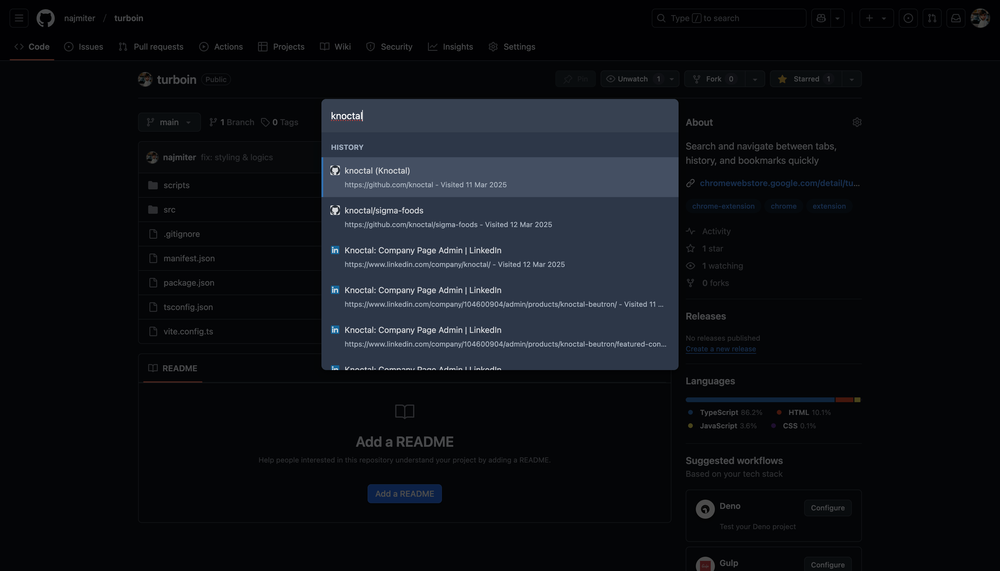
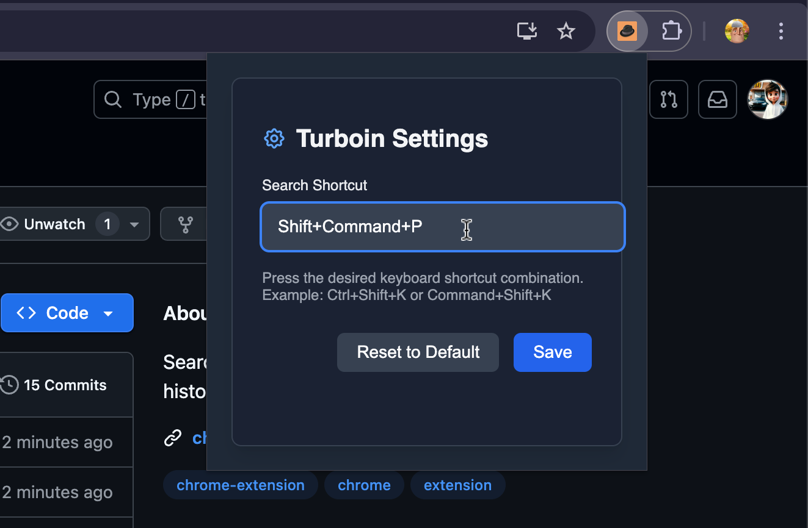

# Turboin

Turboin is a Chrome extension that allows you to quickly search and navigate between your tabs, bookmarks, and browsing history with just a keyboard shortcut.

## Features

- 🔍 **Quick Search**: Instantly search across all open tabs, bookmarks, and browsing history
- ⌨️ **Keyboard Driven**: Navigate entirely using keyboard shortcuts
- 🔀 **Instant Tab Switching**: Jump between tabs without leaving your keyboard
- 🔖 **Bookmark Access**: Open bookmarks directly from the search interface
- 🕒 **History Navigation**: Find and revisit recently visited pages
- ⚙️ **Customizable Shortcuts**: Set your preferred keyboard shortcut for opening the search interface

## Installation

### From Chrome Web Store

1. Visit the [Turboin Chrome Web Store page](https://chromewebstore.google.com/detail/turboin/gnonhllejnghekflninibgaohfbbmekc?authuser=0&hl=en)
2. Click the "Add to Chrome" button
3. Confirm the installation when prompted

## How to Use

1. Press the default keyboard shortcut (`Ctrl+Shift+K` on Windows/Linux or `Command+Shift+K` on Mac) to open the search interface
2. Start typing to search across your tabs, bookmarks, and history
3. Use the up and down arrow keys to navigate through results
4. Press Enter to switch to the selected tab or open the bookmark/history item
5. Press Escape to close the search interface

## Customizing Shortcuts

1. Click on the Turboin extension icon in your browser toolbar
2. The settings popup will appear
3. Click on the "Search Shortcut" input field
4. Press your desired keyboard shortcut combination
5. Click "Save" to apply your custom shortcut

## Screenshots

### Search Interface

### Settings Panel

